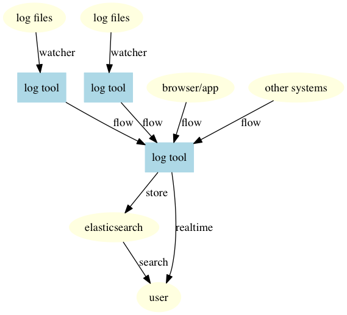
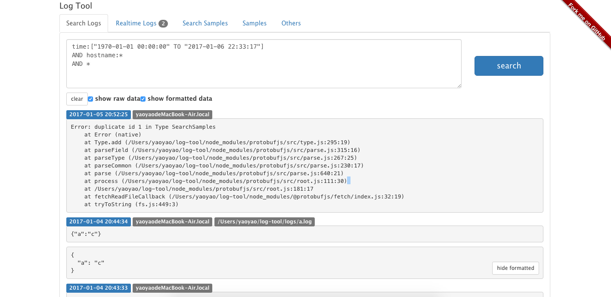
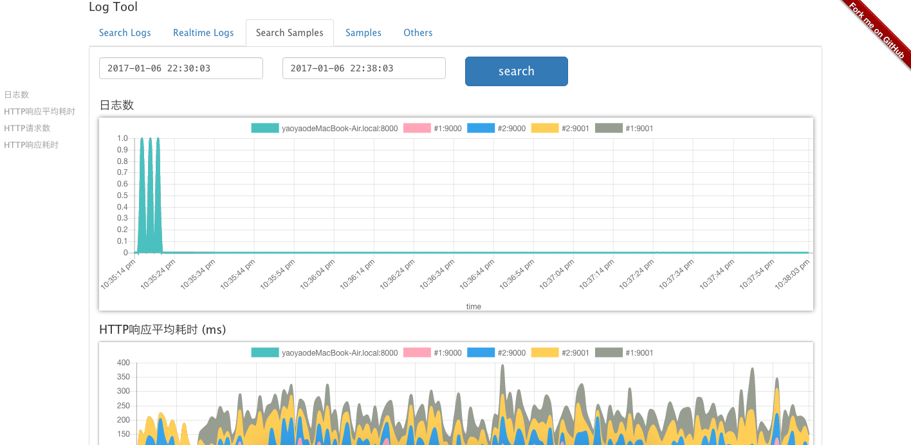

# log-tool

[](https://david-dm.org/plantain-00/log-tool)
[](https://david-dm.org/plantain-00/log-tool#info=devDependencies)
[](https://travis-ci.org/plantain-00/log-tool)
[](https://ci.appveyor.com/project/plantain-00/log-tool/branch/master)
[](https://github.com/plantain-00/log-tool)

## features

+ watch log directories or files and read logs
+ transport logs to another log-tool server
+ save logs to elastic search server
+ push new logs to a web page, for monitor purpose
+ on the web page, search old logs
+ operate(filter, parse) logs as custom scripts



## install

```bash
git clone https://github.com/plantain-00/log-tool-release.git . --depth=1 && npm i --production
```

```bash
node dist/index.js
```

or

```bash
node dist/index.js the-path-to-the-configuration-file
```

Then open `http://localhost:8000` in your browser.

the default configuration file is `./log-tool.config.js`, it's in: [./log-tool.config.js](https://github.com/plantain-00/log-tool/blob/master/log-tool.config.js)

## protocol

The message should be a string from `JSON.stringify(protocol)`(json schema: [./static/protocol.json](https://github.com/plantain-00/log-tool/blob/master/static/flow-protocol.json))

Or a protobuf encoded binary(protobuf file: [./static/protocol.proto](https://github.com/plantain-00/log-tool/blob/master/static/protocol.proto)).

Or just see the type: [./src/types.ts](https://github.com/plantain-00/log-tool/blob/master/src/types.ts)

## create index for elastic

```bash
curl -XPUT http://localhost:9200/tool -d '
{
    "mappings" : {
        "logs" : {
            "properties" : {
                "time": {
                    "type": "date",
                    "format": "yyyy-MM-dd HH:mm:ss"
                },
                "content": {
                    "type": "string"
                },
                "filepath": {
                    "type": "string"
                },
                "hostname": {
                    "type": "string"
                }
            }
        }
    }
}'
```

## demo

### sample 1



### sample 2


